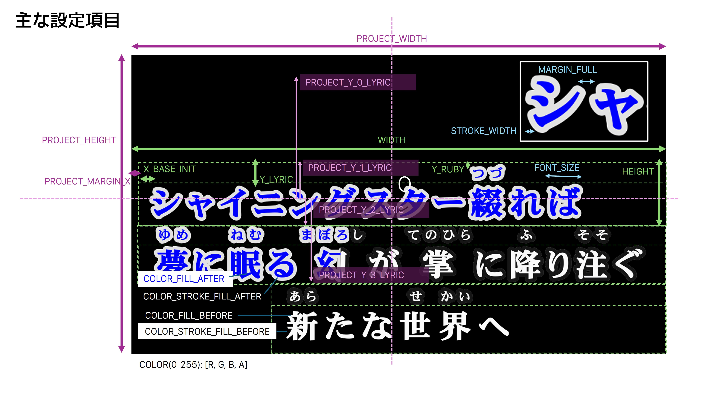

# LRC2EXO-Python


LRC/KRA歌詞ファイル（ルビ付き）からAviUtl向けカラオケ字幕を作成するソフトウェア

- ソフトウェアの利用方法は順次アップデートいたします。

# 注意事項

- ソフトウェアのソースコードは、ライセンスに基づき自由にお使いいただけます。
- 当ソフトウェアを使って（改良した場合を含みます）制作した動画は、動画配信プラットフォームにアップロードすることができますが、利用したソフトとして「LRC2EXO-Python」を動画の説明欄などに記載をお願いいたします。

# はじめに

## ソフトウェア概要

### 特徴
- カラオケ字幕ファイル（LRC、txt2ass向けルビ付きKRAに対応）から、AviUtlで編集ができるカラオケ字幕を生成します。
- 字幕はテキストオブジェクトではなく画像であらかじめ書き出すため、後から画像編集で動画編集ではできない字幕表現を行うことができます。
- 本ソフトウェアは画面を持ちません。歌詞ファイル＋設定ファイルを用意することで多彩な字幕表現を可能にします。

## 主な機能

- １画面につき４行までの歌詞ブロックに対応
- 等幅・プロポーショナルフォントに対応（文字の幅によって自動制御）
- パート分け表示（行頭のアイコン表示）に対応
- 括弧による合いの手歌詞自動認識
- 歌詞・ルビの文字間隔、縁取り幅などの多様な字幕画像の出力設定
- 歌いだし表示時間、字幕残存時間などのEXOのオブジェクト設定

# サンプルファイルを使ったチュートリアル

1. サンプルのプレーンな歌詞ファイル`sample/1_シャイニングスター（出典：魔王魂）.txt`を、タイムタグ歌詞作成ソフト「RhythmicaLyrics」を使って書き出した`sample/1_シャイニングスター（出典：魔王魂）.kra`の中身を確認します。

当ソフトウェアは、空白行を歌詞ブロックの区切りとして認識します。例えば、最初の２行は一つのブロックになります：
```
[00:09:65]た[00:09:83]だ[00:10:39]風[00:10:39]([00:10:39]かぜ[00:11:17])[00:11:17]に[00:11:37]揺[00:11:37]([00:11:37]ゆ[00:11:54])[00:11:54]ら[00:11:71]れ[00:11:90]て[00:12:48]
[00:12:66]何[00:12:66]([00:12:66]なに[00:13:02])[00:13:02]も[00:13:19]考[00:13:19]([00:13:19]かんが[00:14:19])[00:14:19]え[00:14:57]ず[00:14:75]に[00:15:48]
```

途中空白を挟まず３行連続している箇所は、３行をまとめて一つのブロックとして認識します。
```
[00:35:29]シャ[00:35:45]イ[00:35:61]ニ[00:35:76]ン[00:35:94]グ[00:36:09]ス[00:36:24]ター[00:36:58]綴[00:36:58]([00:36:58]つづ[00:37:30])[00:37:30]れ[00:37:49]ば[00:37:94]
[00:38:10]夢[00:38:10]([00:38:10]ゆめ[00:38:46])[00:38:46]に[00:38:66]眠[00:38:66]([00:38:66]ねむ[00:39:22])[00:39:22]る[00:39:64]幻[00:39:64]([00:39:64]まぼろし[00:40:77])[00:40:77]が[00:41:00][00:41:38]掌[00:41:38]([00:41:38]てのひら[00:42:29])[00:42:29]に[00:42:67]降[00:42:67]([00:42:67]ふ[00:43:04])[00:43:04]り[00:43:41]注[00:43:41]([00:43:41]そそ[00:43:96])[00:43:96]ぐ[00:44:44]
[00:44:56]新[00:44:56]([00:44:56]あら[00:44:91])[00:44:91]た[00:45:29]な[00:45:66]世[00:45:66]([00:45:66]せ[00:46:07])[00:46:07]界[00:46:07]([00:46:07]かい[00:46:63])[00:46:63]へ[00:47:19]
```

2. 生成に使いたいお好きなTTFフォントファイルをご用意ください。（OTF、その他の形式にはPythonのソースコードの編集が必要です）
3. `settings.json`を開き、"LYRIC">"FONT_PATH"、"RUBY">"FONT_PATH"にフォントファイルのパスを設定し保存します。
4. ターミナルでこのファイルがあるディレクトリに移動し、以下のコマンドを実行すると字幕の生成を開始します。

```shell
python main.py --input_lrc_path "./sample/2_シャイニングスター（出典：魔王魂）.kra" --exo_output_path "./sample/2_シャイニングスター（出典：魔王魂）.exo"
```

5. 字幕生成の完了後、AviUtlを開き、拡張編集タイムラインの画面からEXOファイルを読み込んでください。
6. 以下のカスタマイズ方法を参照し、字幕の出力設定を変更してください。


# カラオケ字幕作成手順、カスタマイズ方法

## 主な設定項目

