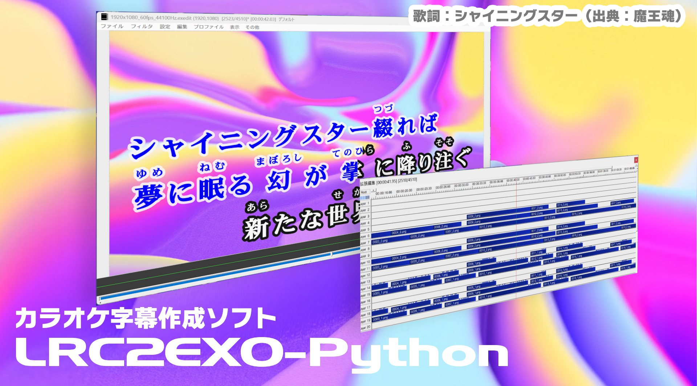

[English](./README_en.md)

# LRC2EXO-Python



LRC/KRA歌詞ファイル（ルビ付き）からAviUtl向けカラオケ字幕を作成するソフトウェア

- ソフトウェアの利用方法は順次アップデートいたします。

# 注意事項

- ソフトウェアのソースコードは、ライセンスに基づき自由にお使いいただけます。
- 当ソフトウェアを使って（改良した場合を含みます）制作した動画は、動画配信プラットフォームにアップロードすることができますが、利用したソフトとして「LRC2EXO-Python」を動画の説明欄などに記載をお願いいたします。

# はじめに

## ソフトウェア概要

### 特徴
- カラオケ字幕ファイル（LRC、txt2ass向けルビ付きKRAに対応）から、AviUtlで編集ができるカラオケ字幕を生成します。
- 字幕はテキストオブジェクトではなく画像であらかじめ書き出します。生成した後で画像編集ができるので、動画編集ソフト単体ではできない字幕表現を行うことができます。
- 歌詞ファイル＋設定ファイルを用意することで多彩な字幕表現を可能にします。
- **タイムタグ付き歌詞に「①」「①②」などの番号を入れておくことで、自動的にパート分け字幕を作ることができます。**


## 主な機能

- １画面につき４行までの歌詞ブロックに対応
- 等幅・プロポーショナルフォントに対応（文字の幅によって自動制御）
- パート分け表示（行頭のアイコン表示）に対応
- 括弧による合いの手歌詞自動認識
- 歌詞・ルビの文字間隔、縁取り幅などの多様な字幕画像の出力設定
- 歌いだし表示時間、字幕残存時間などのEXOのオブジェクト設定

# サンプルファイルを使ったチュートリアル

1. サンプルのプレーンな歌詞ファイル`sample/1_シャイニングスター（出典：魔王魂）.txt`を、タイムタグ歌詞作成ソフト「RhythmicaLyrics」を使って書き出した`sample/1_シャイニングスター（出典：魔王魂）.kra`の中身を確認します。

当ソフトウェアは、空白行を歌詞ブロックの区切りとして認識します。例えば、最初の２行は一つのブロックになります：
```
[00:09:65]た[00:09:83]だ[00:10:39]風[00:10:39]([00:10:39]かぜ[00:11:17])[00:11:17]に[00:11:37]揺[00:11:37]([00:11:37]ゆ[00:11:54])[00:11:54]ら[00:11:71]れ[00:11:90]て[00:12:48]
[00:12:66]何[00:12:66]([00:12:66]なに[00:13:02])[00:13:02]も[00:13:19]考[00:13:19]([00:13:19]かんが[00:14:19])[00:14:19]え[00:14:57]ず[00:14:75]に[00:15:48]
```

途中空白を挟まず３行連続している箇所は、３行をまとめて一つのブロックとして認識します。
```
[00:35:29]シャ[00:35:45]イ[00:35:61]ニ[00:35:76]ン[00:35:94]グ[00:36:09]ス[00:36:24]ター[00:36:58]綴[00:36:58]([00:36:58]つづ[00:37:30])[00:37:30]れ[00:37:49]ば[00:37:94]
[00:38:10]夢[00:38:10]([00:38:10]ゆめ[00:38:46])[00:38:46]に[00:38:66]眠[00:38:66]([00:38:66]ねむ[00:39:22])[00:39:22]る[00:39:64]幻[00:39:64]([00:39:64]まぼろし[00:40:77])[00:40:77]が[00:41:00][00:41:38]掌[00:41:38]([00:41:38]てのひら[00:42:29])[00:42:29]に[00:42:67]降[00:42:67]([00:42:67]ふ[00:43:04])[00:43:04]り[00:43:41]注[00:43:41]([00:43:41]そそ[00:43:96])[00:43:96]ぐ[00:44:44]
[00:44:56]新[00:44:56]([00:44:56]あら[00:44:91])[00:44:91]た[00:45:29]な[00:45:66]世[00:45:66]([00:45:66]せ[00:46:07])[00:46:07]界[00:46:07]([00:46:07]かい[00:46:63])[00:46:63]へ[00:47:19]
```

2. 生成に使いたいお好きなTTFフォントファイルをご用意ください。（OTF、その他の形式にはPythonのソースコードの編集が必要です）
3. `settings.json`を開き、"LYRIC">"FONT_PATH"、"RUBY">"FONT_PATH"にフォントファイルのパスを設定し保存します。
4. ターミナルでこのリポジトリのディレクトリに移動し、以下のコマンドを実行すると字幕の生成を開始します。

```shell
python main.py --input_lrc_path "./sample/2_シャイニングスター（出典：魔王魂）.kra" --exo_output_path "./sample/2_シャイニングスター（出典：魔王魂）.exo"
```

- または、`python main_gui.py`を実行し、GUIアプリでファイルパスを指定して生成処理を実行してください。


5. 字幕生成の完了後、AviUtlを開き、拡張編集タイムラインの画面からEXOファイルを読み込んでください。
6. 以下のカスタマイズ方法を参照し、字幕の出力設定を変更してください。


# カラオケ字幕作成手順、カスタマイズ方法

## 手順概要

1. プレーンな歌詞ファイルを用意する
    - `sample/1_シャイニングスター（出典：魔王魂）.txt`を参考に、最大４行を１ブロック、空白行を区切りとして歌詞ファイルを用意してください。
2. タイムタグ作成ソフトを使ってKRAファイルを書き出す
    - 「RhythmicaLyrics」などのソフトウェアを使いタイムタグを付けた歌詞ファイルをLRCまたはKRAファイルとして保存してください。
    RhythmicaLyricsの場合、「txt2ass向け」のルビ付き歌詞の出力形式に対応しています。
3. フォントファイル、settings.jsonの準備
    - カラオケ字幕に使用したいフォントと、付属の`settings.json`をコピーし設定をカスタマイズしてください。
4. LRC2EXO-Pythonを使用してカラオケ字幕生成
    - 以下のコマンドを実行し、字幕生成を実行してください。
    - または、`python main_gui.py`を実行し、GUIアプリでファイルパスを指定して生成処理を実行してください。

```shell
python main.py --input_lrc_path "＜タイムタグ付き歌詞ファイルのパス＞" --exo_output_path "＜書き出したいEXOファイルのパス＞" --settings_path "＜手順3で用意した設定ファイルのパス＞"
```

5. AviUtlで編集
    - 4で生成したEXOファイルを拡張編集タイムラインから読み込み、必要に応じて画像オブジェクトを編集したうえで動画を書き出してください。

## 主な設定項目


## 設定項目一覧（settings.json）

- 字幕全般の設定

| 変数名                                     | 型                                                     | 説明                                                 |
|--------------------------------------------|--------------------------------------------------------|------------------------------------------------------|
| `GENERAL.WIDTH`                            | int                                                    | 字幕１行分の画像幅                                   |
| `GENERAL.HEIGHT`                           | int                                                    | 字幕１行分の画像高さ                                 |
| `GENERAL.X_BASE_INIT`                      | int                                                    | 1文字目のデフォルトX座標（字幕１行分の画像の左上が原点） |
| `GENERAL.Y_LYRIC`                          | int                                                    | 歌詞のY座標（字幕１行分の画像の左上が原点）           |
| `GENERAL.Y_RUBY`                           | int                                                    | ルビのY座標（字幕１行分の画像の左上が原点）           |
| `GENERAL.COLOR_FILL_BEFORE`                | int[R(0-255), G(0-255), B(0-255), A(0-255)]            | ワイプ前の文字色                                     |
| `GENERAL.COLOR_STROKE_FILL_BEFORE`         | int[R(0-255), G(0-255), B(0-255), A(0-255)]            | ワイプ前の縁色                                       |
| `GENERAL.COLOR_FILL_AFTER`                 | int[R(0-255), G(0-255), B(0-255), A(0-255)]            | ワイプ後の文字色                                     |
| `GENERAL.COLOR_STROKE_FILL_AFTER`          | int[R(0-255), G(0-255), B(0-255), A(0-255)]            | ワイプ後の縁色                                       |
| `GENERAL.COLOR_FILL_BEFORE_CHORUS`         | int[R(0-255), G(0-255), B(0-255), A(0-255)]            | ワイプ前の文字色（合いの手、コーラス用）               |
| `GENERAL.COLOR_STROKE_FILL_BEFORE_CHORUS`  | int[R(0-255), G(0-255), B(0-255), A(0-255)]            | ワイプ前の縁色（合いの手、コーラス用）                 |
| `GENERAL.COLOR_FILL_AFTER_CHORUS`          | int[R(0-255), G(0-255), B(0-255), A(0-255)]            | ワイプ後の文字色（合いの手、コーラス用）               |
| `GENERAL.COLOR_STROKE_FILL_AFTER_CHORUS`   | int[R(0-255), G(0-255), B(0-255), A(0-255)]            | ワイプ後の縁色（合いの手、コーラス用）                 |


- 合いの手、パート分けモード用字幕設定

| 変数名                                     | 型                                                    | 説明                                                 |
|--------------------------------------------|-------------------------------------------------------|------------------------------------------------------|
| `GENERAL.CHANGE_TO_CHORUS_STR`             | str[]                                                 | 合いの手、コーラスモードに移行する対象文字リスト     |
| `GENERAL.CHANGE_TO_MAIN_STR`               | str[]                                                 | 合いの手、コーラスに移行する対象文字リスト           |
| `GENERAL.CHANGE_TO_PART_STR`               | str[]                                                 | パート分けモードに移行する対象文字リスト             |
| `GENERAL.PART_ICON`                        | str[]                                                 | パート分け表示のアイコン画像のパスリスト             |
| `GENERAL.PART_ICON_HEIGHT`                 | int                                                   | パート分けアイコン画像の高さ                         |
| `GENERAL.PART_ICON_OFFSET_X`               | int                                                   | パート分けアイコン画像のX座標オフセット              |
| `GENERAL.PART_ICON_OFFSET_Y`               | int                                                   | パート分けアイコン画像のY座標オフセット              |
| `GENERAL.PART_ICON_MARGIN_X`               | int                                                   | パート分けアイコン画像のX方向余白                    |
| `GENERAL.COLOR_FILL_BEFORE_PART`           | list[int[R(0-255), G(0-255), B(0-255), A(0-255)]]     | パート分けモード用ワイプ前の文字色リスト             |
| `GENERAL.COLOR_STROKE_FILL_BEFORE_PART`    | list[int[R(0-255), G(0-255), B(0-255), A(0-255)]]     | パート分けモード用ワイプ前の縁色リスト               |
| `GENERAL.COLOR_FILL_AFTER_PART`            | list[int[R(0-255), G(0-255), B(0-255), A(0-255)]]     | パート分けモード用ワイプ後の文字色リスト             |
| `GENERAL.COLOR_STROKE_FILL_AFTER_PART`     | list[int[R(0-255), G(0-255), B(0-255), A(0-255)]]     | パート分けモード用ワイプ後の縁色リスト               |


- AviUtlでの字幕表示関連の設定

| 変数名                                         | 型                                      | 説明                                              |
|------------------------------------------------|-----------------------------------------|---------------------------------------------------|
| `GENERAL.DISPLAY_BEFORE_TIME`                  | int(単位：10ミリ秒)                     | ワイプ前字幕表示開始時間                          |
| `GENERAL.DISPLAY_AFTER_TIME`                   | int(単位：10ミリ秒)                     | ワイプ後字幕表示残存時間                          |
| `GENERAL.DISPLAY_CONNECT_THRESHOLD_TIME`       | int(単位：10ミリ秒)                     | 字幕連続切り替え判定閾値時間                      |
| `GENERAL.PROJECT_WIDTH`                        | int(単位：ピクセル)                     | AviUtlプロジェクトの動画幅                        |
| `GENERAL.PROJECT_HEIGHT`                       | int(単位：ピクセル)                     | AviUtlプロジェクトの動画高さ                      |
| `GENERAL.PROJECT_FRAMERATE`                    | int                                     | AviUtlプロジェクトのフレームレート                |
| `GENERAL.PROJECT_MARGIN_X`                     | int(単位：ピクセル)                     | 動画左端からのX座標字幕余白                       |
| `GENERAL.PROJECT_LYRIC_X_OVERLAP_FACTOR`       | float                                   | 多段歌詞の中央寄せ時の重なり具合                 |
| `GENERAL.PROJECT_Y_0_LYRIC`                    | int(単位：ピクセル)                     | 1段目の歌詞Y座標                                 |
| `GENERAL.PROJECT_Y_1_LYRIC`                    | int(単位：ピクセル)                     | 2段目の歌詞Y座標                                 |
| `GENERAL.PROJECT_Y_2_LYRIC`                    | int(単位：ピクセル)                     | 3段目の歌詞Y座標                                 |
| `GENERAL.PROJECT_Y_3_LYRIC`                    | int(単位：ピクセル)                     | 4段目の歌詞Y座標                                 |
| `GENERAL.PROJECT_Y_0_RUBY`                     | int(単位：ピクセル)                     | 1段目のルビY座標                                 |
| `GENERAL.PROJECT_Y_1_RUBY`                     | int(単位：ピクセル)                     | 2段目のルビY座標                                 |
| `GENERAL.PROJECT_Y_2_RUBY`                     | int(単位：ピクセル)                     | 3段目のルビY座標                                 |
| `GENERAL.PROJECT_Y_3_RUBY`                     | int(単位：ピクセル)                     | 4段目のルビY座標                                 |


- 歌詞字幕の設定

| 変数名                                         | 型                                      | 説明                                              |
|------------------------------------------------|-----------------------------------------|---------------------------------------------------|
| `LYRIC.FONT_PATH`                              | str                                     | フォントパス                                      |
| `LYRIC.FONT_SIZE`                              | int(単位：ピクセル)                     | フォントサイズ                                    |
| `LYRIC.STROKE_WIDTH`                           | int(単位：ピクセル)                     | 字幕の縁取り幅                                    |
| `LYRIC.MARGIN_SPACE`                           | int(単位：ピクセル)                     | 半角スペースの余白                                |
| `LYRIC.MARGIN_HALF`                            | int(単位：ピクセル)                     | 半角文字の余白                                    |
| `LYRIC.MARGIN_FULL`                            | int(単位：ピクセル)                     | 全角文字の余白                                    |
| `LYRIC.TEXT_WIDTH_MIN`                         | int(単位：ピクセル)                     | 最小文字幅                                        |
| `LYRIC.Y_DRAW_OFFSET`                          | int(単位：ピクセル)                     | 文字描画時のY座標オフセット（フォントによるずれを補正）       |


- ルビ字幕の設定

| 変数名                                         | 型                                      | 説明                                              |
|------------------------------------------------|-----------------------------------------|---------------------------------------------------|
| `RUBY.FONT_PATH`                               | str                                     | フォントパス                                      |
| `RUBY.FONT_SIZE`                               | int(単位：ピクセル)                     | フォントサイズ                                    |
| `RUBY.STROKE_WIDTH`                            | int(単位：ピクセル)                     | 字幕の縁取り幅                                    |
| `RUBY.MARGIN_SPACE`                            | int(単位：ピクセル)                     | 半角スペースの余白                                |
| `RUBY.MARGIN_HALF`                             | int(単位：ピクセル)                     | 半角文字の余白                                    |
| `RUBY.MARGIN_FULL`                             | int(単位：ピクセル)                     | 全角文字の余白                                    |
| `RUBY.TEXT_WIDTH_MIN`                          | int(単位：ピクセル)                     | 最小文字幅                                        |
| `RUBY.Y_DRAW_OFFSET`                           | int(単位：ピクセル)                     | 文字描画時のY座標オフセット（フォントによるずれを補正）       |
